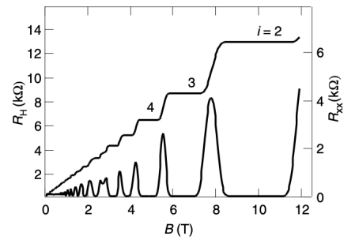

# Lecture 1 - Introduction to Topology in Condensed Matter Physics

In this course, we aim to give an overview of many different aspects of topology in condensed matter physics. We hope to show the its importance in this area of physics and why it is an active research field. We will begin in this lecture by demonstrating the usefulness of a topological description and how it can be used to explain robust phenomena. To do this we will explore the integer quantum Hall effect. However, first we wish to introduce why we may wish to study topological phases.

## Topological Phases of Matter - An Overview

The role of topology in condensed matter physics has been a key area of research in recent years with a key motivator being the desire to further our classification of phases of matter. 'Traditional' phases of matter are characterised by a local order parameter which we can use to identify the phase. Transitions to more ordered states then involve the breaking of a symmetry. This is the Ginzburg-Landau theory of spontaneous symmetry breaking and underpins many of the phase transitions we are familiar with - for example, magnetisation, superconductors and the water phase diagram.

</img>

However not all phases of matter are characterised by a local parameter, examples of which are the topological phases that will be discussed in this course (as well as those that go beyond the scope of these introductory lectures). In particular we will consider three classes
 
- Free fermions
- Symmetry protected topological (SPT) phases
- Topologically ordered states

A simplistic view of a topological state is that it remains the same under continuous deformations - the classic example is that a coffee cup is the same as a doughnut, with the characterisation being that they have the same number of holes.

</img>

In quantum mechanics the topology is often viewed as continuous deformations of the Hamiltonian and providing a gap in the spectrum is not closed then a phase transition does not occur. In this way we have topologically protected states.

## The Quantum Hall Effect

One of the early examples of using topology to explain physical phenomena came in the form of the integer quantum Hall effect. 

This is an experiment performed on a two-dimensional semiconducting structure (often referred to as a 2d electron gas, or 2DEG). A voltage is applied in the $x$-direction and then in the presence of a magnetic field, a current is observed in the $y$-direction too. In the integer quantum Hall effect, we find that in a disordered system there are plateaus in the Hall resistance (the resistance in the $y$-direction). We show the typical results from an integer quantum Hall epxeriment below.

</img>

We wish to highlight the following results

- Initially the Hall resistance is linear in the magnetic field. This region can be explained using the classical Hall effect as we will see shortly.
- The resistance in the $x$-diection peaks when there are jumps in the Hall resistance.
- There are clear plateuas in the Hall resistance. They have a height (if we consider resistivity rather than resistance) of 

$$
\rho_{\rm H} = \frac{h}{e^2}\frac{1}{\nu}
$$

where $\nu \in \Z$. The height and positions of these plateaus are robust to disorder (and in fact they even require disorder), as well as the size and geometry of the sample. 

This robustness suggests that topology may be useful in explaining these results, but first let's explore one of the other explanations.

## Classical Hall Effect

Let's begin with a discussion of the classical Hall effect. The setup is similar. We consider a 2d metal with an in-plane electric field and a magnetic field perpendicular, ${\bm B} = B_z \hat{\bm z}$ to the sample.

INSERT FIG

The equation of motion for the electrons is given by 

$$
m\dot{\bm v} = -e{\bm E} - e{\bm v}\times {\bm B} - \frac{m {\bm v}}{\tau}
$$

where the last term is a scattering term, with the scattering rate given by $\tau^{-1}$. In equilibrium, $ \dot{\bm v} =0$ and we can use that for an electron density of $n$, the current density is given by ${\bm J}=-ne{\bm v}=\sigma{\bm E}$. The conductivity is then a matrix given by

$$
\sigma = \frac{\sigma_0}{1+\omega_{\rm c}\tau^2}\left(\begin{matrix} 1 &-\omega_{\rm c}\tau \\ \omega_{\rm c}\tau & 1 \end{matrix}\right)
$$

where $\sigma_0 = ne^2\tau/m$ is the standard Drude conductivity and $\omega_{\rm c} = eB_z/m$ is the cyclotron frequency. We can take the inverse of this matrix to obtain the resistivity, with the Hall resistivity then being given by

$$
\rho_{\rm H}\equiv \rho_{12}=\frac{B}{ne}
$$

This result along with the relationship between the components of $\rho$ and $\sigma$ allow us to explain the first two points reagrding the quantum Hall results we highlighted above. We now need to understand the plateaus and this is done using Landau levels.

## Landua Levels

In this course we won't provide the details of Landau levels but rather summarise some results that allow us to see how we may explain the plateuas observed in quantum Hall.

In the presence of a magnetic field, electrons will perform cyclotron orbits, with a frequency $\omega_{\rm c}$ and will have discrete energy levels given by

$$
E_n = \hbar \omega_{\rm c}(n+\tfrac{1}{2})
$$

This looks like the harmonic oscialltor, however the levels here are highly degenerate. We can break this degeneracy using an electric field

INSERT FIG

## Topology

An alternative way of understanding the integer quantum Hall effect is through topology.

## Berry Phase and Topological Invariants
As we emphasised in the introduction, this course will not focus on the mathematical field of topology, however there are number of related concepts that appear in condensed matter and here we aim to introduce a couple of them.

Let's consider a Hamiltonian that depends on various parameters ${\boldsymbol \lambda} = {\boldsymbol \lambda}(t)$ that vary with time. At a given instant of time the eigenstates are given by

$$
H_{\boldsymbol \lambda} \ket{n_{\boldsymbol \lambda}(t)} = E_{n_{\boldsymbol \lambda}}(t) \ket{n_{\boldsymbol \lambda}(t)}.
$$

If we assume the Hamiltonian is changing adiabatically, that is the parameters are varying sufficiently slowly, then if we start in an eigenstate, we will remain in an eigenstate up to a phase. Therefore, the state to consider is 

$$
\ket{\psi_{n_{\boldsymbol \lambda}}(t)} = \mathrm{e}^{-i\theta(t)}\ket{n_{\boldsymbol \lambda}(t)}.
$$

Substituting this state into the Schrödinger equation and taking the inner product with $\bra{n_{\boldsymbol \lambda}(t)}$ gives a differential equation for the phase $\theta (t)$,

$$
\hbar \partial_t \theta(t) = E_{n_{\boldsymbol \lambda}}(t) - i\hbar \bra{n_{\boldsymbol \lambda}(t)}\partial_t\ket{n_{\boldsymbol \lambda}(t)}.
$$

Integrating with respect to time we find two contributions to the phase $\theta (t) = \varphi (t) - \gamma_n$.The first of these is the standard dynamical phase encountered in untiary evolution

$$
\varphi (t) = \frac{1}{\hbar}\int_0^t E_{n_{\boldsymbol \lambda}}(t') \hspace{5pt} {\rm d}t',
$$

and the second contribution (which is also real so that $\theta$ is just a phase - there is no decay involved) is known as the Berry phase

$$
\begin{aligned}
\gamma_n &= i\int_0^t \bra{n_{\boldsymbol \lambda}(t')}\partial_{t'}\ket{n_{\boldsymbol \lambda}(t')} {\rm d}t' \\ &= i \oint \bra{n_{\boldsymbol \lambda}}\nabla_{\boldsymbol \lambda}\ket{n_{\boldsymbol \lambda}} \cdot {\rm d}{\boldsymbol \lambda}
\end{aligned}
$$

where in the second line we have used that the time dependence of the states originates from the time dependence of ${\boldsymbol \lambda}$ in order to write it in a form where it depends on the path through parameter space but is independent of time. For this reason, the Berry phase is sometimes known as a geometric phase. 

An additional comment is that the integral is over a closed path. We won't delve into details of the gauge invariance here, but the essential point is that the Berry phase can not be removed by a simple gauge transformation for closed paths, but rather it is modified by an integer$\times 2\pi$. 

In addition to the Berry phase, there are a couple of other quantities that are useful to be aware of. The first is the the Berry Connection (sometimes called the Berry vector potential),

$$
{\boldsymbol A_n}({\boldsymbol \lambda})=i\bra{n_{\boldsymbol \lambda}}\nabla_{\boldsymbol \lambda}\ket{n_{\boldsymbol \lambda}}. 
$$

This is not a gauge invariant quantity but it can be useful to define one, which leads to the Berry connection. In 3-dimensions, this takes the form

$$
\Omega_n({\boldsymbol \lambda}) = \nabla_{\boldsymbol \lambda} \times {\boldsymbol A_n}({\boldsymbol \lambda})
$$

## Returning to Quantum Hall

In condensed matter, a common surface of interest is the 2d Brillouin zone (which is peridioc due to points only being defined up to a lattice vector). Using the above ideas, we define a topological invariant

$$
C = \frac{1}{2\pi}\int_{BZ}\Omega({\boldsymbol k}) \hspace{2pt} {\rm d}{\bf k}
$$

where $\Omega({\boldsymbol k}) = \partial_{k_x}A_y({\boldsymbol k}) -  \partial_{k_y}A_x({\boldsymbol k})$. 

This an integer known as the Chern number and only changes when we have a energy gap closing (i.e. a topological phase transition). TALK ABOUT THE CHERN NUMBER BEING OVER FULL BANDS AS THE SUM OVER ALL BANDS IS ZERO.

Now, it can be shown that the conductance in the QHE can be expressed in terms of the Chern number

$$
\sigma = 
$$

A natural question to ask is why a current that is characterisitc of the edge modes in the system can be characterised by the Chern number which is a bulk property of the system (remember that the Brillouin zone is periodic in the calculation of the Chern number). Well, the solution to this is a principle known as the bulk-boundary correspondence. This states that

