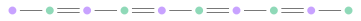

# Lecture 2 - Topological Insulators I

## The SSH Model

The SSH model is a simple model that demonstrates topological properties. In this model we have unit cells consisting of two different sublattices, $A$ and $B$. The intracell and intercell hopping strengths are given by $t_1$ and $t_2$ respectively.

</img>

The Hamiltonian is given by 

$$
H = t_1\sum_n \left(b_n^\dagger a_n+a_n^\dagger b_n\right)+t_2\sum_n \left(a_{n+1}^\dagger b_n+b_n^\dagger a_{n+1}\right).
$$

Initially, let's explore the bulk properties of the system. In order to do this we assume periodic boundary conditions, meaning that every unit cell is effectivley in the middle of an infinite system. Assuming these boundary conditions allows us to take the Fourier transform

$$
a_n = \sum_k {\rm e}^{ikn}a_k, 
$$

to give

$$
H = t_1\sum_k (b_k^\dagger a_k+a_k^\dagger b_k) +t_2 \sum_k\left({\rm e}^{-ik}a_k^\dagger b_k+{\rm e}^{ik}b_k^\dagger a_k\right)
$$

We can write this in the form $H = \sum_k \Psi_k^\dagger H_k \Psi_k$ with $\Psi_k = \left(a_k, b_k \right)^{\rm T}$ and 

$$
H_k = \left(\begin{matrix}0 &t_1+t_2{\rm e}^{-ik} \\t_1+t_2{\rm e}^{ik} &0 \end{matrix}\right)
$$

We can then obtain the energy spectrum by solving the eigenvalue equation $H_k \Psi_k = E_k \Psi_k$

$$
E_k^2 = (t_1+t_2{\rm e}^{-ik})(t_1+t_2{\rm e}^{ik}) \implies E_k = \pm\sqrt{t_1^2+t_2^2+2t_1t_2\cos k}
$$

<iframe src="../../_static/plots/ssh_dispersion.html" width="100%" height="800" style="border:none;"></iframe>

From the expression for the energy, as well as the plot we make a couple of remarks. First if $|t_1| \neq |t_2|$, then the spectrum is gapped (no modes that cross zero energy) for all $k$. The system in this phase is an insulator. However when $|t_1| = |t_2|$, it can be possible to close the gap, such that the system becomes a conductor. The gap closes at 

$$
k=0 \hspace{4pt}\mathrm{for } \hspace{4pt} t_1=-t_2\\ k=\pi  \hspace{4pt}\mathrm{for} \hspace{4pt} t_1=t_2
$$

It is precisely at these points that a topological phase transition can occur. We now need to identify when we are in the topological phase and try to understand its properties. Let's begin by calculating the topological invariant. To do this we write $H_k$ in the form

$$
H_k = \left(\begin{matrix}0 &t_1+t_2\cos k-it_2\sin k \\t_1+t_2cosk +it_2 \sin k &0 \end{matrix}\right) = d_0(k) \sigma_0 + {\bm d}(k)\cdot {\bm \sigma}
$$

with

$$
d_0 = d_z=0,\\
d_x = t_1 + t_2 \cos k, \hspace{5pt} d_y = t_2 \sin k
$$

In the above the notation $\sigma_0$ is the identity and ${\bm \sigma}$ is a three-dimensional vector of Pauli matrices. Using these definitions, the invariants is defined as 

$$
\nu = \frac{1}{2\pi}\int {\rm d}k \left(\frac{{\bm d}}{|{\bm d}|}\times \frac{\partial}{\partial k} \frac{{\bm d}}{|{\bm d}|}\right)_z
$$

Notice the subscript $z$, so when we expand out the cross-product, it doesn't look too dissimilar from the Chern number. However, it is different and in this case is known as the Winding number. The reason for this name is that as $k$ goes from $0\rightarrow 2\pi$, the vector ${\bm d}$ traces a circle and this invariant simply counts how many time the vector winds around the origin. 

Performing this integral gives $\nu=1$ for $|t_1|<|t_2|$ and $\nu = 0$ otherwise. The non-zero winding signifies a non-trivial topological phase which we will now demonstrate by considering the edge states. 

### Edge States

Let's start by considering the case of 

NEED TO INSERT FIGURES

## The Haldane Model

