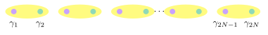
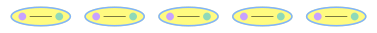
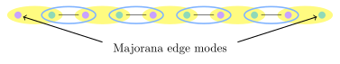
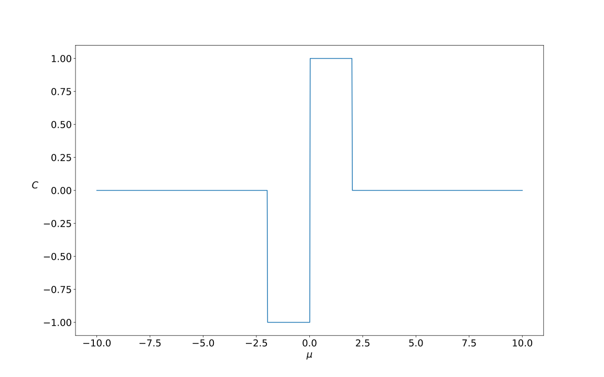

# Lecture 4 - Topological Superconductors

In this lecture, we turn our attention from topological insulators to topological superconductors. These systems have gained increasing interest in recent years, both due to their interesting fundamental physics but also for their potential use in realising a topological quantum computer. 

In order to introduce the concepts we start with a one-dimensional model initially introduced by Kitaev. Again, we will see that the topological properties are characterised by an invariant with associated edge modes. In the second half of the lecture we will look at a two-dimensional topological superconductor, where again there are edge modes, but in this case there are zero modes which are localised to the edge or to vortices and it is these modes that used in proposed implementations for topological quantum computing.

## The Kitaev Chain

There are many models named after Kitaev (and even others that are referred to the Kitaev chain), but here we refer to the model of a one-dimensional $p$-wave spinless superconductor. The Hamiltonian is 

$$
H = -t\sum_{m=1}^{N-1}\left(c_{m+1}^\dagger c_m + c_m^\dagger c_{m+1}\right) - \mu\sum_{m=1}^Nc_m^\dagger c_m + \sum_{m=1}^{N-1}\left(\Delta c_m c_{m+1} + \Delta^*c_{m+1}^\dagger c_m^\dagger\right)
$$

As is the usual first step, we explore the bulk spectrum by performing the Fourier transform

$$
H = \sum_k (-2t \cos k -\mu)c_k^\dagger c_k + \sum_k(i\Delta \sin k \hspace{3pt}c_{-k}c_k-i\Delta^* \sin k \hspace{3pt} c_k^\dagger c_{-k}^\dagger)
$$

One of the key differences of this compared to the models we have looked at so far is that $k$ and $-k$ are mixed. This is a feature of superconductors and the standard way to solve Bardeen-Cooper-Schrieffer (BCS) superconductors is to use a Bogoliubov transformation that mixes electron (with energy-momentum $(E,k)$) and hole ($E,-k$) operators. The resulting eigenstates (quasiparticles) of the theory are known as Bogoliubov quasiparticles. We effectively perform the same transformation here by writing the Hamiltonian in Bogoliubov-de Gennes (BdG) form. This symmetrises $k$ and $-k$ and in this case leads to

$$
H = \frac{1}{2}\sum_k \Psi_k^\dagger H_k \Psi_k, \hspace{20pt} H_k= \left(\begin{matrix} \varepsilon_k & \tilde{\Delta}_k^*\\ \tilde{\Delta}_k & -\varepsilon_k \end{matrix}\right)
$$

where $\Psi_k = (c_k \hspace{5pt} c_{-k}^\dagger)^{\rm T}$, $\varepsilon_k = -2t\cos k - \mu$, and $\tilde{\Delta}_k=2i\Delta\sin k$.

It is then straightforward to obtain the energy spectrum

$$
E(k) = \pm \sqrt{\varepsilon_k^2 - |\tilde{\Delta}_k|^2}=\pm \sqrt{(2t \cos k +\mu)^2 + 4|\Delta|^2\sin^2 k}
$$

For $\Delta\neq0$, the gap closes at two points; $(1): \mu=-2t$ (at $k=0$), and $(2):\mu=2t$ (at $k=\pi$). 

Therefore, we have now identified where the different topological phases occur. In order to find out which are the topologically non-trivial phases, we can calculate a topological invariant. However, in this course we will focus on a more intuitive approach that focuses on the topological edge states.

### Majorana Modes

By writing the pairing amplitude in the form $\Delta = |\Delta|{\rm e}^{i\phi}$, we can introduce Majorana operators  (often called Majorana fermions) in the following way

$$
\gamma_{2m-1}= {\rm e}^{i\phi/2}c_m + {\rm e}^{-i\phi/2}c_m^\dagger
\\ \gamma_{2m} = -i\left({\rm e}^{i\phi/2}c_m - {\rm e}^{-i\phi/2}c_m^\dagger \right)
$$

We wish to make a few notes regarding the introduction of these operators

1. Both $\gamma_{2m-1}$ and $\gamma_{2m}$ are associated with the site $j$. 
2. The Majorana operators obey anticommutation relations, $\{\gamma_m, \gamma_n\} = 2\delta_{m,n}$, as well as $\gamma_{2m}^\dagger = \gamma_{2m}$ and $\gamma_{2m}^2=1$.
3. In theory, we can write any fermionic Hamiltonian in terms of these Majorana fermions, although this is often not useful.

</img>

Using these operators, we can rewrite the Hamiltonian in the form

$$
H = \frac{-i\mu}{2}\sum_{m=1}^{N}\gamma_{2m-1}\gamma_{2m} +\frac{i}{2}\sum_{m=1}^{N-1} \left( (t+|\Delta|)\gamma_{2m}\gamma_{2m+1} +(-t+|\Delta|)\gamma_{2m-1}\gamma_{2m+2} \right)
$$

As we have found with previous models, one of the benefits of the topological protection is that we can study specific parameters and providing we don't close a bulk gap, the effects remain robust. 

Let's start with $t=|\Delta|=0, \mu \neq0$. This means that depending on the sign of $\mu$, we can satisfy either $\mu<-2t$ or $\mu >2t$. For these parameter the Hamiltonian simply reduces to

$$
H=-\frac{i\mu}{2}\sum_{m=1}^N \gamma_{2m-1}\gamma_{2m} = -\mu\sum_{m=1}^N c_m^\dagger c_m
$$

</img>

Here, we have effectively paired the Majorana fermions belonging to the same lattice site. As we saw with the SSH model, all sites are paired up in this limit and the edges aren't particularly relevant. This is therefore the trivial regime. The second equality above, allows us to easily understand this ground state. For $\mu <0$, adding a spinless fermion to the lattice costs energy and so the ground state is simply the empty (vacuum state). For $\mu>0$, the opposite happens and the ground state is the completely filled state.

The region we now need to understand is $-2t<\mu<2t$. To analyse this we take $t=|\Delta|>0, \mu=0$. In this limit the Hamiltonian becomes 

$$
H = it\sum_{m=1}^{N-1} \gamma_{2m} \gamma_{2m+1} 
$$

</img>

We are now effectively pairing Majoranas between different sites. As we saw with the SSH model this leaves modes at the ends of the system, which do not appear in the Hamiltonian and therefore are zero-energy modes. The key difference here is that we have a pair of **Majorana** zero modes. If we want to ask whether or not the Majorana mode is there we actually have to consider the occupation of corresponding fermionic mode, which in this case is non-local. The fermionic operator is given by $f=\tfrac{1}{2}(\gamma_1+i\gamma_{2N})$ and therefore the occupation of this mode also costs no energy in the limit of a large system size. The non-local nature of this mode (along with the fact that occupied/unoccupied represents two states) gives some initial indication that such a setup could be used to create a topologically protected qubit!

## p+ip Superconductor

We now turn our attention to two dimensions (although we still assume the system is spinless). The Hamiltonian is 

$$
H = -t\sum_{m,n}(c_{m+1, n}^\dagger c_{m,n} + c_{m, n+1}^\dagger c_{m,n} + c_{m,n}^\dagger c_{m+1, n} + c_{m,n}^\dagger c_{m, n+1}) - \mu\sum_{m,n}c_{m,n}^\dagger c_{m,n} \\ + \sum_{m,n} (\Delta c_{m,n}c_{m+1, n} + i\Delta c_{m,n}c_{m, n+1} + \Delta^* c_{m+1,n}^\dagger c_{m,n}^\dagger -i\Delta^*c_{m, n+1}^\dagger c_{m,n}^\dagger)
$$

We can perform the Fourier transform and write the Hamiltonian in BdG form

$$
H_{\boldsymbol k}= \left(\begin{matrix}\varepsilon_{\boldsymbol k} & \tilde{\Delta}^*_{\boldsymbol k} \\ \tilde{\Delta}_{\boldsymbol k} &-\varepsilon_{\boldsymbol k}\end{matrix}\right)
$$

this time with $\varepsilon_{\boldsymbol k}=-2t(\cos k_x + \cos k_y)-\mu$ and $\tilde{\Delta}_{\boldsymbol k}=2i\Delta(\sin k_x + i\sin k_y)$.

We wish to now highlight a couple of points regarding this Hamiltonian. The first regards the continuum limit ($k\rightarrow 0$ here), where the pairing term becomes proportional to $k_x+ik_y$. Due to the relation $p=\hbar k$, this is commonly referred to as the $p_x+ip_y$, or $p+ip$ superconductor.

The second point we wish to address is the symmetries of the Hamiltonian. Out of the three symmetries we discussed in the last lecture (particle-hole, time-reversal, and chiral) only particle-hole symmetry is present here. Time-reversal symmetry is broken as we have a spinless system. Therefore the invaraint is a $\mathbb{Z}$-invariant and is simply the Chern number. We can calculate this numerically to obtain the following result.

</img>

### Topological States

We now wish to understand the states found in the topological regime of which there are two types we will consider here - edge modes and zero modes.

#### Majorana Edge Modes
 

As was true when we looked at the 1d case, the edge modes here are actually Majorana. In this model though they are chiral Majorana modes, described by a Hamiltonian with a linear dispersion $\varepsilon_k\sim \hbar vk$

$$
H_M = -i\hbar v \int {\rm d}x \gamma(x)\partial_x \gamma(x) = \hbar v \sum_k k \gamma_{-k}\gamma_k
$$

where we have used that $\gamma_k^\dagger = \gamma_{-k}$. In general the bulk-boundary correspondence for topological superconductors relates the Chern number of the number of chiral Majorana modes. This is in contrast to what we encountered with topological insulators where the Chern number relates to the number of chiral fermionic modes. We will now see that these two modes are related.

A chiral fermion is described by
$$
H_M = -i\hbar v_{\rm F} \int {\rm d}x \psi^\dagger (x)\partial_x \psi(x) = \hbar v_{\rm F} \sum_k k \psi^\dagger_{k}\psi_k
$$

We can define Majorana operators via $\psi_k = \gamma_{1,k}+i\gamma_{2,k}$ and $\psi_k^\dagger = \gamma_{1,-k}-i\gamma_{2,-k}$. We see that each fermion here corresponds to two Majoranas and therefore it is perhaps not suprising that when we substitute this into the above Hamiltonian, we find that

$$
H = \hbar v_{\rm F} \sum_k k (\gamma_{1,-k}\gamma_{1,k}+\gamma_{2,-k}\gamma_{2,k})
$$

Therefore we see that a single chiral fermionic mode is equivalent to 2 copies of chiral Majorana fermion. Alternatively we can view a chiral Majorana mode as half a fermionic mode. In particular this relates to the real or imaginary parts, which we can see on the level of the operators. From our above definitions we see that $\gamma_{1,k}$ is the real part of the fermion (sometimes also called the electron + hole mode as it is proportional to $\psi_k + \psi_{-k}^\dagger$) and $\gamma_{2,k}$ is the imaginary part of the fermion (or the electron - hole mode). 

A natural question to ask at this point could be related to the usefulness or implications of this relation between fermionic and Majoran edge modes. Well this has direct consequences in heterostrucutres that combine and scatter the two modes and has also been proposed as a way to implement certain operations in quantum computing.

#### Vortices

In the 2d topological superconductors there is another type of boundary state - zero modes. Here we will outline a simple argument to show that vortices can host Majorana zero modes. 

Start by consdiering a disc shaped topological superconudctor surrounded by a trivial regime. The system will have an chiral mode at its edge but with $k = \tfrac{2\pi}{L}(n+\tfrac{1}{2})$, so that there are no exact zero modes at $E=0, k=0$. This arises due to the anti-periodic boundary conditions imposed on the wavefunction in this setyp but a more intuitive explanantion is that the spectrum needs to be symmetric due to the particle-hole symmetry. A single $k=0$ mode would clearly violate this.

There are two ways to get around this problem though:
1. We could put the model on a cylinder. This has two edges and so we could have two modes at $k=0, E=0$ (one on each edge). We won't focus on this here though.
2. We could introduce a flux through the system - in other words, introduce vortices.

If we introduce a vortex (which has $\pi$-flux), then the boundary conditions on the wavefunction shift to periodic. Therefore the allowed $k$ are now $k = \tfrac{2\pi}{L}n$. This suggests that zero modes are allowed, however we still need to respect the symmetry of the spectrum and therefore we must have two zero modes. The first of these is located at the edge and the second of these must therefore be bound to the vortex - this is a Majorana zero mode. If we increase the number of vortices then we increase the number of zero modes. Even if the number of voritces is even and the boundary conditions are anti-perioidc again, the vortices can host an even number of zero modes so that the symmetry is respected, although in this case the edge mode does not have a zero mode.

</img>

These modes have come under a lot of interest in recent years as they have interesting exchange statistics. In fact the zero modes behave as anyons (in particular Ising anyons) and therefore can be used as part of schemes to implement topologically protected quantum computation. We will see more about Ising anyons in the coming lectures.

## Summary

In this lecture we have introduced topological superconductors and shown that, like the other topological phases we have encountered, there are gapless edge modes that are protected. Unique to the topological superconductors however is the possibility of using vortices to host Majorana zero modes. Spatially separating these modes allows us to define a protected qubit. Additionally, the vortices have non-abelian anyonic exchange statistics, which is something we will consider further in the coming lectures. Towards the end of this course we will aslo see why these anyons are relevant for quantum computing, which is an ongoing research area.